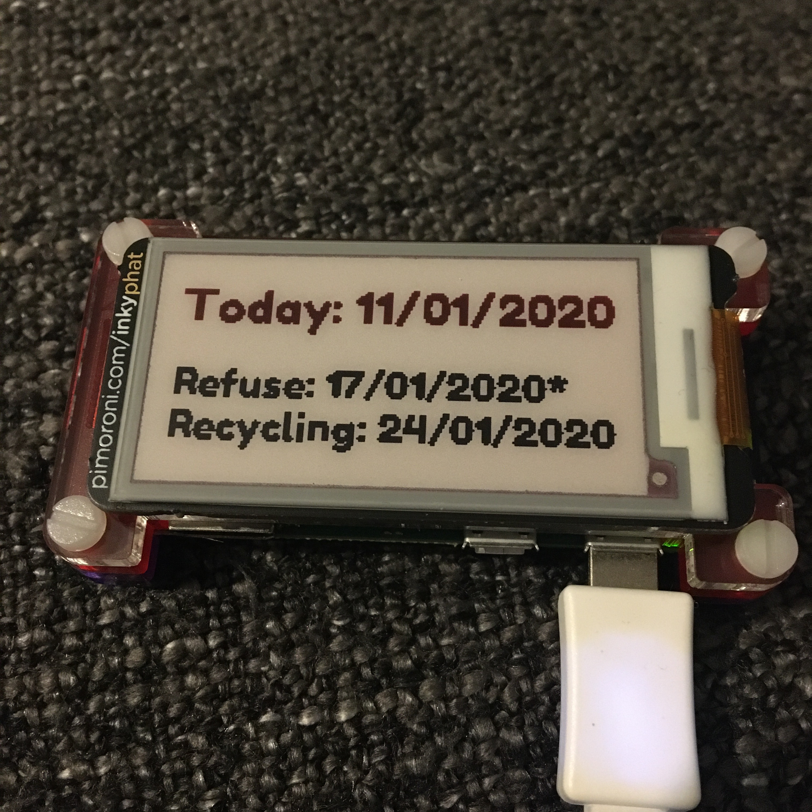
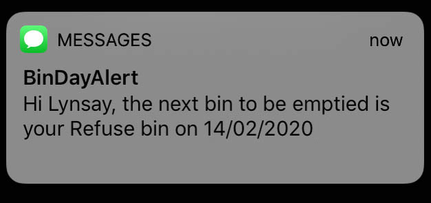

# 🗑 Bin Day Alert ♻️

      

Script to grab the date of the next bin collection from the Local Council's website.

## Description
This script requests the HTML of the Local Council's webpage.  XPath expressions are then used to navigate the DOM, returning information relating to the dates various bins will be emptied (e.g. refuse, recycling, food, etc.).  This information is then written to an Inky pHAT e-paper display from [Pimoroni](https://github.com/pimoroni), attached to a Raspberry Pi Zero W.  

It is suggested the script is run regularly as a cron job (once at midnight, once at 12 noon).  You will need to modify the XPath expression to allow it to work with your Local Council's website.

## Requirements
To run the script, the following packages are required:

* `Pillow` - Python Imaging Library (Fork) Pillow
* `inky` - Python library for the [Pimoroni](https://github.com/pimoroni) Inky pHAT e-paper display
* `lxml` - Used to parse the DOM of the webpage
* `requests` - Requests the HTML of a webpage
* `nexmo` - SMS service

Install these via pip:

`pip install Pillow inky lxml requests nexmo`

Suggested cron schedule (twice per day- midnight and at 12 noon):
`0 0 * * * /usr/bin/python /home/pi/BinDayAlert/Code/binDayAlert.py >> /home/pi/log.txt 2>&1`
`0 12 * * * /usr/bin/python /home/pi/BinDayAlert/Code/binDayAlert.py >> /home/pi/log.txt 2>&1`

## 🔨To complete
- Tidy script
